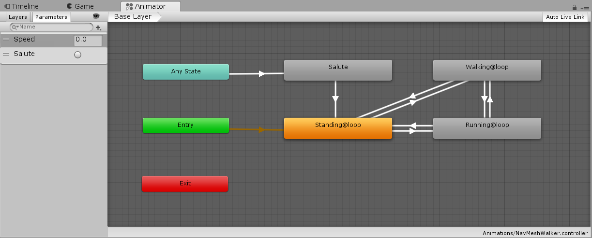

# NavMeshWalker
NavMeshAgentの歩き方をCharacterControllerで制御します。

# 前提
- Unity2017.3以降で動作確認

# ライセンス
## SDユニティちゃん
本リポジトリーに含まれるSDユニティちゃんのモデルは、ユニティちゃんライセンスで提供されています。

<div><p>この作品は<a href="http://unity-chan.com/contents/license_jp/" target="_blank">ユニティちゃんライセンス条項</a>の元に提供されています</p></div>

## その他のスクリプトやデータについて
[MIT License](LICENSE.md)

Copyright (c) 2018 Yu Tanaka

---

# サンプルの実行方法
[こちら](https://am1tanaka.github.io/NavMeshWalker/Demo/index.html)でWebGLのデモを試せます。

マウスでユニティちゃんを移動させたい先の床を指します。クリックは不要です。

Unityで試す場合は、ScenesフォルダーのSampleSceneをダブルクリックして開いてPlayします。

# 組み込み方
プロジェクトへの組み込み方です。おおよそ、以下のような流れです。

1. パッケージのダウンロードと組み込み
1. NavMeshをベイク
1. NavMeshWalkerの設定
1. 指定の場所を設定するスクリプト
1. キャラクターを差し替える
1. アニメーションの設定

組み込みたいプロジェクトを開いた状態で作業をします。

## 1. パッケージのダウンロードと組み込み
歩かせるゲームオブジェクトのプレハブを組み込みます。

- [Releasesページ](https://github.com/am1tanaka/NavMeshWalker/releases)から、最新版の**NavMeshWalker.?.?.?.unitypackage**をダウンロードします
- プロジェクトにインポートします

## 2. NavMeshをベイク
移動ルートを作成するためのNavMeshをベイクします。手順は以下の辺りが参考になると思います。

- [Unityマニュアル. NavMesh ビルドコンポーネント
ナビメッシュの作成](https://docs.unity3d.com/jp/current/Manual/nav-BuildingNavMesh.html)
- <a href="http://monolizm.com/sab/pdf/%E7%AC%AC26%E5%9B%9E_%E3%83%97%E3%83%AC%E3%82%BC%E3%83%B3%E8%B3%87%E6%96%99(Unity%E3%81%AF%E3%81%98%E3%82%81%E3%82%8B%E3%82%88%EF%BD%9ENavMesh%E5%9F%BA%E7%A4%8E%EF%BD%9E).pdf">monolizm LLC. Unityはじめるよ
〜NavMesh基礎〜</a>

SDユニティちゃんを使う場合、以下ぐらいの設定が丁度よさそうでした。


ベイク結果は以下のような感じです。


ベイクしても水色のゾーンが作成されていない場合、足場が*Navigation Static*になっていない可能性があります。*Static*設定するのが手っ取り早いです。


## 3. NavMeshWalkerの設定
歩かせるゲームオブジェクトのプレハブ**NavMeshWalker**をシーンに配置します。

- *Project*ビューで、*NavMeshWalker/Prefabs*フォルダーを開きます
- *NavMeshWalker*プレハブを、シーンかヒエラルキーにドラッグ&ドロップして、配置します

Playを開始すると、マウスで指した場所に、SDユニティちゃんが歩いていくようになります。

キャラクターが歩く速度や、旋回速度は、*NavMeshWalker*の以下の項目で調整できます。


|項目|内容|
|:-:|:--|
|Walk Speed|歩く速度。大きくすると速くなります。|
|Angular Speed|旋回する時の角速度です。大きくすると速くなります。|
|Turn Angle|目的地がこの角度よりずれている場合、移動せずにその場で方向転換します。|
|Turn Angular Speed|その場で方向転換する時の回転速度です。大きくすると速くなります。|
|Speed Down Distance|目的地がこの距離より近い場合、旋回角度の大きさに応じて歩きを遅くします。|
|Stop Distance|目的地がこの距離以内の場合は到着とみなします。|
|Speed 2 Anim|移動速度とアニメーションの速度を調整します。大きくすると、移動速度に対して、アニメーションが速くなります。|
|Stop Speed|移動がこの速度より遅くなったら、アニメーションを立ちアニメにします。|
|Average Speed|アニメの速度を平均化するための係数。細かく旋回する時に立ち絵が挟まると不自然になるので、この値でこれまでの速度と新しい速度を平均化します。|

キャラクターが登れる斜面や段差については、*Character Controller*で設定します。Character Controllerについては[こちら](https://docs.unity3d.com/jp/current/Manual/class-CharacterController.html)の公式マニュアルを参照ください。

## 4. 指定の場所を設定するスクリプト
### マウスで指した場所に移動する動きの解除方法

デフォルトの*NavMeshWalker*には、マウスで指した場所に移動を設定するデモのための**Mouse Click Target**スクリプトが設定されています。


この動作が不要になったら**Remove**して下さい。

### スクリプトで移動先を設定する方法
スクリプトから移動先を設定する方法です。

- 座標を設定するためスクリプトの冒頭で、以下の`using`を追加します

```cs
using AM1.Nav;
```

- アタッチしたスクリプトに、*NavController*を保持する変数を宣言します。ここに、*Unity*のインスペクターで*NavMeshWalker*をドラッグ＆ドロップするなどして、指示先のインスタンスを設定します

```cs
public NavController Target;
```

- 座標を設定するのは、`Target`の`SetDestination()`メソッドに、目指す座標を渡します

```cs
Target.SetDestination(target);
```

これで、スクリプトから移動先を制御できます。

目的地に到着しているかは、以下で確認できます。

```cs
if (Target.IsReached) {
    // 到着している
}
```

## スクリプト例
[こちら](https://github.com/am1tanaka/NavMeshWalker/blob/master/Assets/NavMeshWalker/Demo/Scripts/ClickDetector.cs)に、オブジェクトをクリックしたら、設定された場所にNavMeshWalkerオブジェクトを向かわせるスクリプトの例があります。

## 5. キャラクターを差し替える
キャラクターを差し替える手順です。デフォルトの*NavMeshWalker*オブジェクトは、子供にSDユニティちゃんのプレハブを持っています。


- 差し替えたいキャラクターを同じように子供にして、*SD_unitychan_humanoid*は削除します


- モデルの座標を`0, 0, 0`にして、奥を向くように回転を調整します


- *Animator*コンポーネントをアタッチして、*Controller*にアニメーターデータを設定します。サンプルとして、SDユニティちゃんのアニメデータを利用した簡単なものを**Animations/NavMeshWalker**に用意してあります


スクリプトで移動を制御する場合、`Apply Root Motion`が悪さをする場合があるので、チェックを外しておくとよいでしょう。問題が起きたらチェックを戻してください。

- SDユニティちゃんのアニメを利用する場合、表情変更のイベントを受け取る必要があります。エラーが出ないようにスタブメソッドを定義した`FaceCatcher.cs`を用意したので、`Demo/Scripts`フォルダーから、`Animator`コンポーネントをアタッチしているオブジェクトにドラッグ＆ドロップしてアタッチします


以上で差し替え完了です。


# 6. アニメーションの設定
サンプルのアニメーターは以下のようなシンプルなものです。



このうち、サンプルでは**Standing**と**Walking**しか使っていません。

## サンプルのAnimatorを利用する場合
Animatorはそのまま利用して、Animationを他のものに差し替えるには、Animatorの各状態に設定されているAnimationを変更してください。

- Animatorウィンドウで差し替えたい状態を選択します


- *Inspector*の*Motino*欄に、変更したいアニメーションをドラッグ&ドロップします


これでアニメーションのみを差し替えることができます。

## 独自でAnimatorを作る場合
Animatorを変更したい場合は、`Float`型の`Speed`パラメーターを定義してください。


スクリプトから、このパラメーターにキャラクターの移動速度を渡しています。この値を使って*Standing*や*Walking*、必要なら*Running*を切り替えるようにしてください。

# 制約
NavMeshAgentは常に着地して移動するようになっているため、ジャンプや落下はできません。それらをやりたい場合は、着地しているかを判定して、空中の時はNavMeshAgentを無効にして、着地したら有効にするような制御が必要になります。

また、到着判定でY値を無視するようになっているので、立体交差があるようなマップだと正常に到着が判定できない可能性があります。

# 不具合報告
不具合がありましたら、[Issues](https://github.com/am1tanaka/NavMeshWalker/issues)にご報告いただければ幸いです。

# 参考・関連URL
- [Unityマニュアル. ナビゲーションと経路探索](https://docs.unity3d.com/jp/current/Manual/Navigation.html)
- [Unityマニュアル. Character Controllerマニュアル](https://docs.unity3d.com/jp/current/Manual/class-CharacterController.html)
- <a href="http://monolizm.com/sab/pdf/%E7%AC%AC26%E5%9B%9E_%E3%83%97%E3%83%AC%E3%82%BC%E3%83%B3%E8%B3%87%E6%96%99(Unity%E3%81%AF%E3%81%98%E3%82%81%E3%82%8B%E3%82%88%EF%BD%9ENavMesh%E5%9F%BA%E7%A4%8E%EF%BD%9E).pdf">monolizm LLC. Unityはじめるよ
〜NavMesh基礎〜</a>
- [UNITY-CHAN! OFFICIAL WEBSITE](http://unity-chan.com/)
